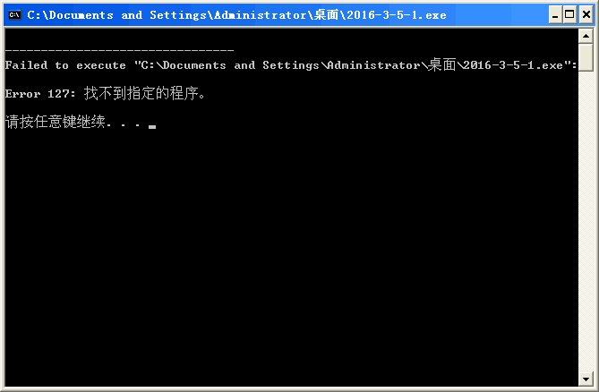
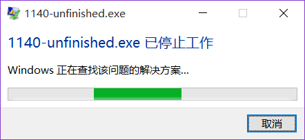

# About OI-codes
coding for NOIP.

## 各种传送门
### [成外OJ 成都外国语学校自己的OJ](http://www.cwoj.tk/)
#### [openjudge题库传送门](http://noi.openjudge.cn/)
#### [CodeVS题库传送门](http://www.codevs.cn/)
#### [落谷题库传送门](http://www.luogu.org/)
#### [Vijos题库传送门](https://vijos.org/)

ACM只是兴趣，各位。

### 有趣的代码
[让OJ直接mle的程序](./tools/mle.c)

希望小伙伴们能帮我解决问题:joy:真的<br/>
题目框架——

```c
/*
作者:千里冰封
题目:
*/

#include <stdio.h>

int main(int argc, char* argv[]) {
    int a, b;
    scanf("%i%i", &a, &b);
    return 0;
}
```
祝全世界OIer都这样：<br/>
<br/>

